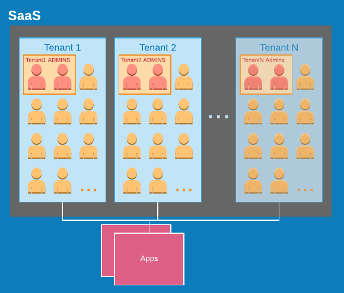

# Introduction

The Okta Identity Cloud provides a rich set of APIs and services that can be used to develop custom solutions for SaaS use-cases. We demonstrate these capabilities with [okta-dac](https://github.com/oktadeveloper/okta-dac), a sample application that implements the common use-case(s) of providing delegated administration (aka "self service") capabilities to SaaS tenants.

There are generally 2 approaches when it comes to architecting multitenancy with Okta. The first involves what's known as "hub and spoke" architecture, which requires an Okta Org for each tenant and incurs additional cost and overhead. The second involves only one Org. 

This documentation focuses on the second approach. If you're building a multitenant application, read on to decide if the single org architecture is right for you.

## Next Steps
Navigate to the [Guide](/guide) section to get started.

::: warning Disclaimer
okta-dac is community-supported and is maintained by members of the Okta team for developers and other IT professionals. BYOB-dashboard is not an official Okta product and does not qualify for any Okta support. Okta makes no warranties regarding this project. Anyone who chooses to use this project must ensure that their implementation meets any applicable legal obligations including any Okta terms and conditions.

It is recommended that you collaborate with your preferred [Okta Solution Provider](https://www.okta.com/partners/meet-our-partners/?field_partner_type_tid=8101&field_solutions_target_id=6061) to implement and adapt this app code sample within your existing portal. This app features frontend and backend components and like any web app hosted and running on your side, you should perform a code review, as well as security and scalability tests.
:::
