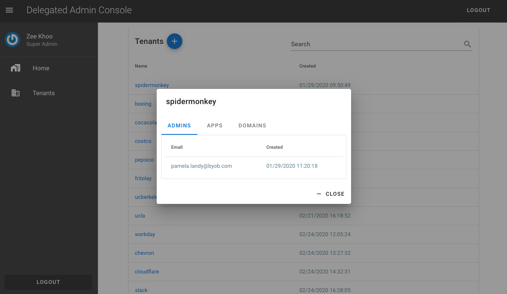
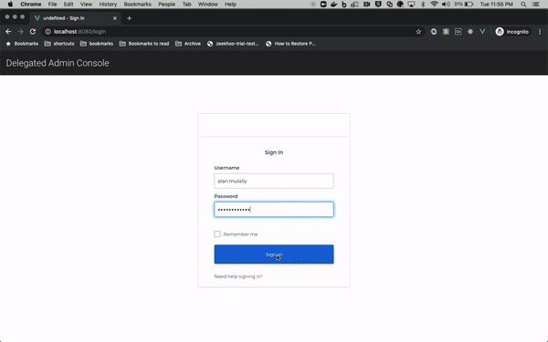

# Introduction
This is the design architecture documentation for the "__Delegated Admin Console__" aka [okta-dac](https://github.com/udplabs/okta-dac) open source project *and its companion project, "__End-user Dashboard__" aka [byob-dashboard](https://github.com/oktadeveloper/byob-dashboard)*.

Using native Okta capabilities, we:
1. **Add a "tenant" layer to an Okta Org** using custom setup of [Groups](/guide/architecture.html#groups) and [Roles](/guide/architecture.html#group-admin-role)
2. **Provide tenant self-service administration** by leveraging [OAuth for Okta](/guide/architecture.html#oauth-for-okta). 
    * Users in any particular tenant can have 1 of 2 roles: *User* and *Tenant Admin*. Tenant Admins can access the __Delegated Admin Console__ app. And all users can access the __End-user Dashboard__ app.
3. **Support "bring your own IdP"** using Okta's [Inbound Federation](https://developer.okta.com/docs/concepts/identity-providers/) functionality
4. **Protect API resources** with Okta's [API Access Management](/guide/architecture.html#api-access-management)
    * We configure Okta to generate JWTs embedding tenant info; We design our API endpoints to implement tenant-namepsace in the request url; And we implement a custom authorizer to restrict access to the tenant-namepsaced route based on tenant info embedded in the JWT (the Bearer token of the API request).

## Delegated Admin Console
This section discusses the Admin App

### Superuser
About the Superuser role

### Tenant Admin
About the Tenant Admin role

#### Manage Users

#### Configure IdP

## End-user Dashboard
This section discusses the End-User Dashboard

