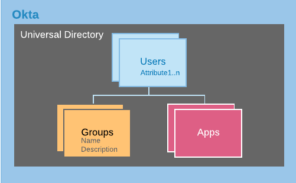
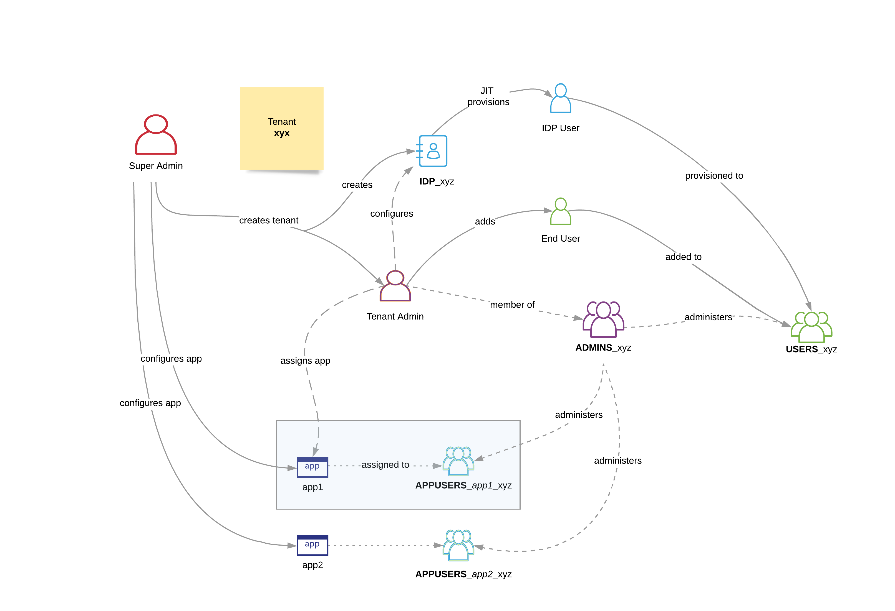

# Architecture
## Okta Basics: Users, Groups, Applications

An Okta Org supports having only one directory of users, who belong to one or more groups. Groups in Okta are flat, but users can belong to any number of groups. Users are *assigned* to applications. And groups can also be assigned to applications (When a group is assigned to an application, all users of the group are assigned to the application). The user object can store any number of custom attributes. Groups can store a name and description. 



## Groups
Although Groups in Okta are flat in structure and only store name and description, it is acceptable practice to use naming convention and/or namespacing to simulate group-types, group hierarchy or nested group structures. One key feature of Okta Groups is that the API supports [search](https://developer.okta.com/docs/reference/api/groups/#search-groups) with ***startsWith***, which allows us to support our architecture. We illustrate with some examples, below.

### Example 1: Group Hierarchy

Okta can support nested groups (or group hierarchy) by applying namespacing to the group name. For example, a hierarchy looking like the following:


Can be *flattened* and represented with the following group naming convention:

| Group Name |
| ---------- |
| okta.com   |
| okta.com/dac |
| okta.com/dac/admins  |
| okta.com/dac/users  |
| okta.com/byob |
| okta.com/byob/users |

---
### Example 2: Group Types

Okta can support having group types by naming convention by prefixing group names with the group type:
| Type       | Group      | Naming Convention |
| ---------- | ---------- | ----------------- |
| role       |  readonly  |  role_readonly    |
| role       |  admin     |  role_admin       |
| ou         |  sales     |  ou_sales         |
| ou         | engineering|  ou_engineering   |
* In order to list all the groups of a single type, use the search groups API with `search string = group type`
    ```
    GET https://${yourOktaDomain}/api/v1/Groups?q=${groupType}
    ```
* In order to search for a group by name (within a group type) simply prefix the search string with the group type
    ```
    GET https://${yourOktaDomain}/api/v1/Groups?q=${groupType}startsWith
    ```
---
### okta-dac:

In the okta-dac project, we implement the *Example 2* design pattern to create 2 classes of users – 1) Admins, and 2) Users – By prefixing group names with either **ADMINS_** and **USERS_**, respectively. 

The string following the prefix refers to the tenant name. For example, if we have 2 customers, `tenant1` and `tenant2` in our SaaS application, we'll have 2 sets of groups: `ADMINS_tenant1`, `ADMINS_tenant2` and `USERS_tenant1`, `USERS_tenant2` in Okta. 

Each customer's user is a member of their respective `USERS_` group. If the user is also a Tenant Admin, they'll be assigned to the `ADMINS_` group.




## Group Admin Role
Okta supports **delegated admin** functionality by allowing users to hold the [Group Admin Role](https://help.okta.com/en/prod/Content/Topics/Security/admin-role-groupadmin.htm) role. This functionality allows specific groups to be designated to specific Group Admins; And will restrict the Group Admins to only be able to view and perform updates those specifc groups (and the users in them).

Read more about the different [Administrator Roles](https://help.okta.com/en/prod/Content/Topics/Security/Administrators.htm) in Okta to get a better understanding of how we leveraged the Group Admin role.

## OAuth for Okta
### What is [OAuth for Okta](https://developer.okta.com/docs/guides/implement-oauth-for-okta/overview/)?

### What is an Okta session?

With an existing session, we can **fetch the bearer token** using the [Okta Auth JavaScript SDK](https://github.com/okta/okta-auth-js). Upon logging into the __Delgated Admin Console__ app, the first component we land on is the Home.vue component. This would be a good place to fetch the token. 
```js{19}
// src/views/Home.vue

const authJs = new AuthJS({
    issuer: this.$config.oidc.issuer.split("oauth2")[0],
    clientId: this.$config.oidc.client_id,
    redirectUri: this.$config.oidc.redirect_uri,
    pkce: true
});
const exists = await authJs.session.exists();
if (exists) {
    try {
        const res = await authJs.token.getWithoutPrompt({
            scopes: [
                "openid",
                "okta.users.manage",
                "okta.groups.manage"
            ]
        });
        const accessToken = res.filter(token => { return token.accessToken; })[0];

        // vuex
        this.$store.commit("setO4oToken", accessToken.accessToken);
        this.$store.subscribe((mutation, state) => { console.log("Got mutation", mutation.type); });

    } catch (e) {
        console.log(e);
    }
}
```

* [`authJs.session.exists()`](https://github.com/okta/okta-auth-js#sessionexists) checks to see if user has logged-in (i.e. an Okta session exists)
* [`authJs.token.getWithoutPrompt()`](https://github.com/okta/okta-auth-js#tokengetwithoutpromptoptions) makes an OAuth "authorize" request and authenticates using an existing session.

## API Access Management
[API Access Management](https://developer.okta.com/docs/concepts/api-access-management/) overview

### Embedding the `tenants` claim
How we configured Okta

### Embedding the `groups` claim
How we configured Okta

### Custom Authorizer

In the custom authorizer, we restrict access to the tenant-namespaced route based on which tenant the user is an ADMIN of:
```js
jwt.claims.groups.forEach(grp=>{
    if (grp.startsWith('ADMINS_')) {
        policy.allowMethod(AuthPolicy.HttpVerb.GET, "/admin/api/v1/tenants/" + grp.split('_')[1]);
        policy.allowMethod(AuthPolicy.HttpVerb.PUT, "/admin/api/v1/tenants/" + grp.split('_')[1] + "/admins/*");
    }
});
```
