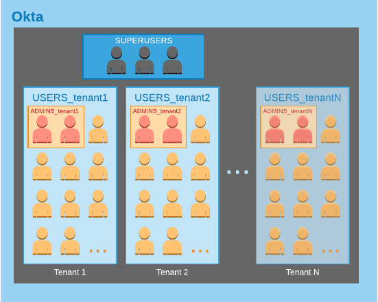
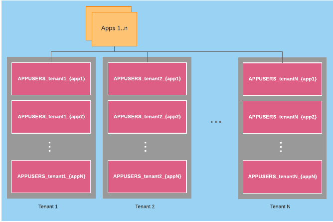

# Architecture

## Okta Basics: Users, Groups & Apps

* An Okta Org supports having only one directory of users, and those users belong to one or more groups.
* Groups in Okta are flat, but users can belong to any number of groups. 
* Users are *assigned* to apps. 
* Groups can also be assigned to apps (When a group is assigned to an app, all users of the group are assigned to the app). 
* The user object can store any number of custom attributes. 
* Groups can store a name and description. 


## Groups
Although Groups in Okta are flat in structure and only store name and description, it is acceptable practice to use naming convention and/or namespacing to simulate group-types, group hierarchy or nested group structures. **A key feature of Okta groups which allows us to do this is the groups API [search](https://developer.okta.com/docs/reference/api/groups/#search-groups) that supports *startsWith***. Let's illustrate with a couple examples, below.

### Example 1: Group Hierarchy

You can implement nested groups (or group hierarchy) by applying hierarchical namespacing to the group name. For example, a hierarchy looking like the following:


Can be *flattened* and represented with the following naming convention:

| Group Name |
| ---------- |
| okta.com   |
| okta.com/dac |
| okta.com/dac/admins  |
| okta.com/dac/users  |
| okta.com/byob |
| okta.com/byob/users |

---
### Example 2: Group Types

You can implement group types by prefixing group names with the group type:
| Type       | Group      | Naming Convention |
| ---------- | ---------- | ----------------- |
| role       |  readonly  |  role_readonly    |
| role       |  admin     |  role_admin       |
| ou         |  sales     |  ou_sales         |
| ou         | engineering|  ou_engineering   |
* In order to list all the groups of a single type, use the search groups API with `search string = group type`


| GET | `https://${yourOktaDomain}/api/v1/Groups?q=${groupType}` |
| --- | --- |

* In order to search for a group by name (within a group type) simply prefix the search string with the group type

| GET | `https://${yourOktaDomain}/api/v1/Groups?q=${groupType}${startsWith}` |
| --- | --- |

---
### okta-dac mapping

#### ADMINS_ and USERS_ Groups
In the okta-dac project, we use the *Example 2* design pattern to create 2 types of user groups – 1) Admins, and 2) Users – by prefixing group names with either **ADMINS_** and **USERS_**, respectively. The string following the prefix refers to the tenant name. 

For example, if we have 2 customers, `tenant1` and `tenant2` in our SaaS application, we'll have 2 sets of groups: `ADMINS_tenant1` + `ADMINS_tenant2` and `USERS_tenant1` + `USERS_tenant2`. Each customer's user is a member of their respective `USERS_` group. If the user is also a Tenant Admin, they'll be assigned to the `ADMINS_` group. 

So with this naming convention in place, we coerced our Okta org into a structure that our SaaS application needs:



#### SUPERUSERS Group
We mentioned "Super Admins" before so let's go over how we modeled this in Okta. As previously described [here](/guide/#super-admin), the "Super Admin" __role__ allows access to the **okta-dac Super Admin UI**. As shown in the diagram above, this is simply a __SUPERUSERS__ group. The way okta-dac is implemented, if a user belongs to this group, they will see the Super Admin UI when logging into otkta-dac. On the other hand, if they are not in this group, they will see the Tenant Admin UI.

How does okta-dac know which UI to present? We [configure Okta](/setup/org-setup.html#_6-add-custom-claims) to include the list of groups memberships in users' JWTs. Then, business logic implemented by the okta-dac app inpspects the JWT information to determine if the user is a super admin or not.

#### APPUSERS_ Groups
Another concept of okta-dac is that each tenant has access to a number of products that the SaaS provider provides, but not always to all products (For example, Tenant_A only purchased Product_A, whereas Tenant_B purchased Product_A, Product_B and Product_C). So we model this by setting up the `APPUSERS` group. For every app/product that a tenant is entitled to, a group `APPUSERS_${tenant}_${appId}` is created. These groups are assigned to the respective app. 

So how does okta-dac implement assigning a user to an app/product? Simple: When we assign a user to an app we are simply just adding the user to the group.



## Group Admin Role
Okta natively supports **delegated admin** functionality at the group level via the [Group Admin Role](https://help.okta.com/en/prod/Content/Topics/Security/admin-role-groupadmin.htm). You can configure rules in Okta to allow users in a group to gain permissions to read and manage a list of (other) groups. Using this functionality, **we configure `ADMINS_tenant` groups as group-admins-for `USERS_tenant` + `APPUSERS_tenant` groups**. And thus, we get the following behavior:
* Tenant Admins, as members of their own `ADMINS_${tenant}` group, **can then read and manage users** in their `USERS_${tenant}` group. 
* They can assign/unassign apps for their tenant users by being able to add/remove `USERS_${tenant}` users to/from their `APPUSERS_${tenant}` groups.

::: tip Additional Reading
Read more about the different [Administrator Roles](https://help.okta.com/en/prod/Content/Topics/Security/Administrators.htm) in Okta to get a better understanding of how we leveraged the Group Admin role
:::

## IdPs
One key functionality of okta-dac is the ability for Tenant Admins to self configure their own IdPs for SAML authentication. Okta already provides support for [External Identity Providers](https://developer.okta.com/docs/concepts/identity-providers/) out of the box. However, since we are adding a custom tenant layer that isn't natively supported by Okta, this means we'll be adding some more custom implementation.

In okta-dac, we maintain a mandatory 1:1 mapping between a Tenant and an IdP. This means we always create one IdP per Tenant regardless of whether the Tenant is going to use IdP authentication; IdP settings are simply set to `status=inactive` where the Tenant is not using IdP authentication.

The 1:1 mapping allows us to do a couple things:
1. First, we overload IdP and treat it as THE Tenant
    * So, we use the IdP's id as the `tenant id`.
    * And a bit of implementation detail here...we store this id in the `profile.description` of the `ADMINS_` group as a JSON string (We will need it stored here for handly lookup in many places in the app.):
    ```json{12}
    {
        "id": "00gpht48f2bSI7jZw0h7",
        "created": "2020-01-29T17:55:02.000Z",
        "lastUpdated": "2020-05-02T23:15:32.000Z",
        "lastMembershipUpdated": "2020-02-11T23:47:59.000Z",
        "objectClass": [
            "okta:user_group"
        ],
        "type": "OKTA_GROUP",
        "profile": {
            "name": "ADMINS_spidermonkey",
            "description": "{\"tenantId\": \"0oaphsztw1XNmNqbb0h7\"}"
        }
    }
    ```
2. Allows us to implement the [List Tenants](/api/#list-tenants-with-pagination) API: 
    * This is done by wrapping the [list identity providers](https://developer.okta.com/docs/reference/api/idps/#list-identity-providers) API, **which supports pagination**. We simply map its results to display them as Tenant (instead of Idp)
    * Now we can implement reading back thousands of Tenants in paginated results.
    * We could have used [search groups](https://developer.okta.com/docs/reference/api/groups/#search-groups) to search the `ADMINS_` groups instead. But this API would not have given us pagination and is limited to 300 results.

# The Final Picture:
Finally, this is how everything maps out:

* Each Tenant is represented by excatly 1 Idp, 1 `ADMINS_${tenant}` group, and 1 `USERS_${tenant}` group, where:
    * Idp represents the Tenant
    * Users in the `ADMINS_${tenant}` group are Tenant Admins
    * All users belonging to a tenant are members of `USERS_${tenant}`
* For each App a tenant is entitled to, there is an `APPSUERS_${tenant}` group.
* The `ADMINS_${tenant}` group posesses the __Group Admin role__. It targets itself, the `USERS_${tenant}`, and all the `APPUSERS_${tenant}` groups.
* Super Admins belong to the `SUPERUSERS` group

--- 
# Next Steps
__Head over to the [next ->](api-design) section for a discussion on the backend design.__
