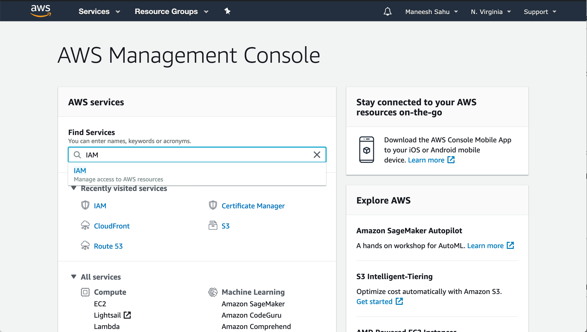
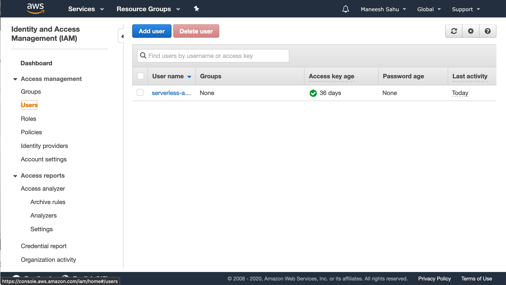
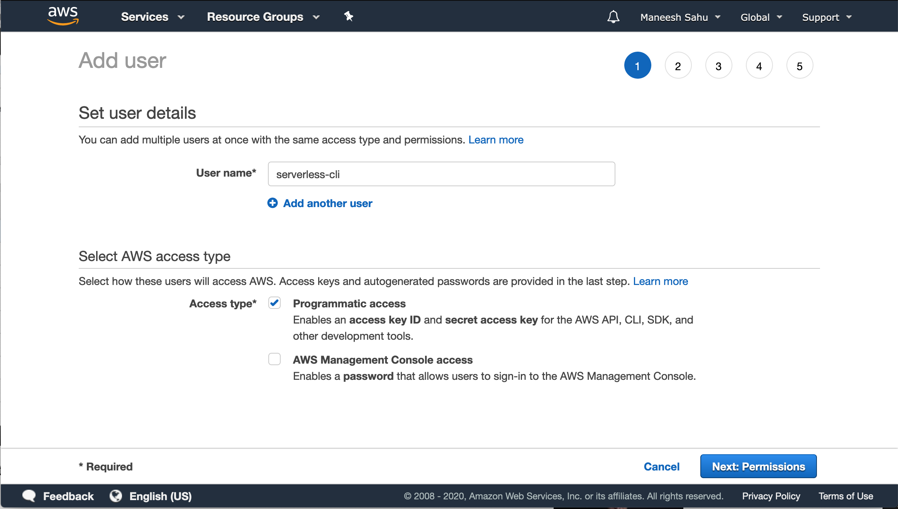
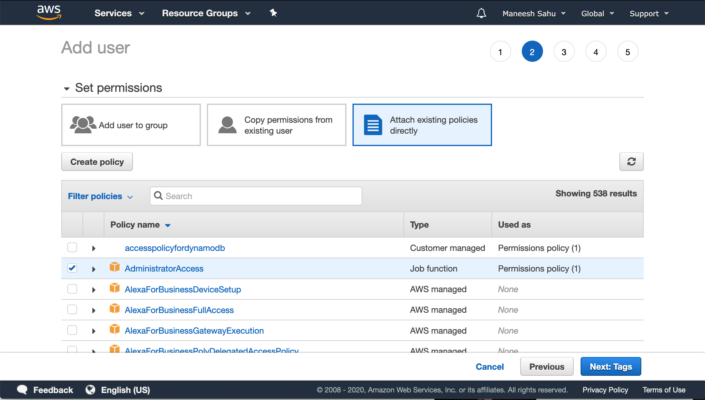
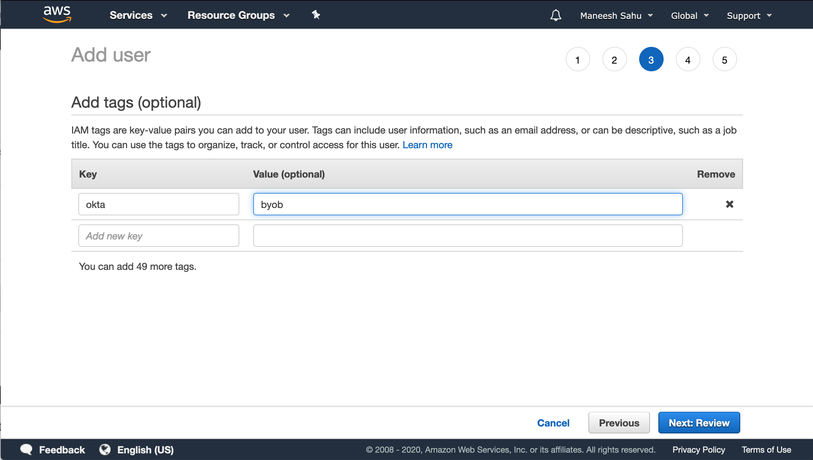
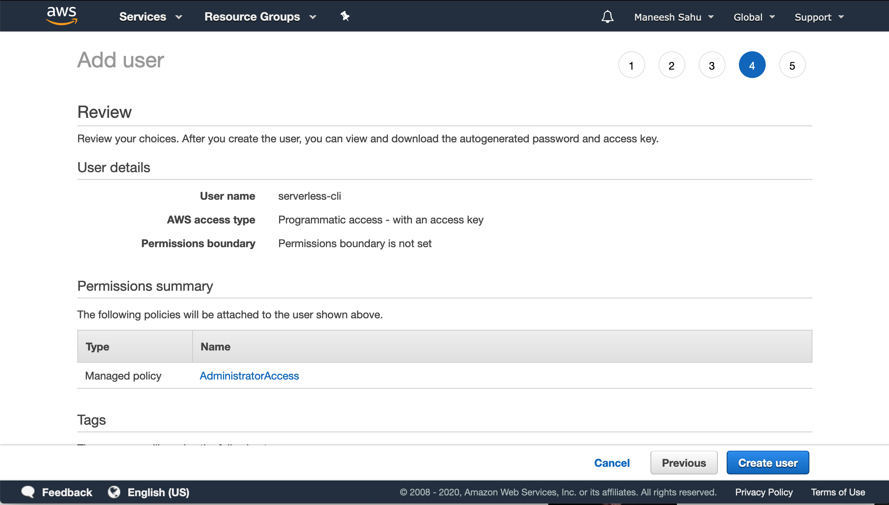
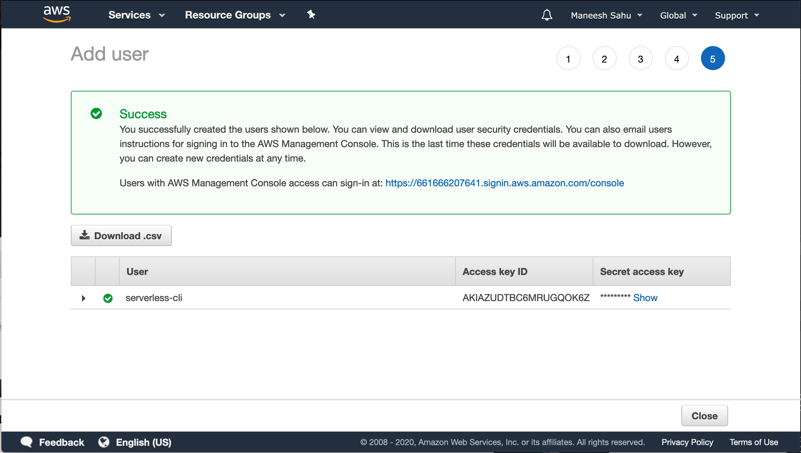
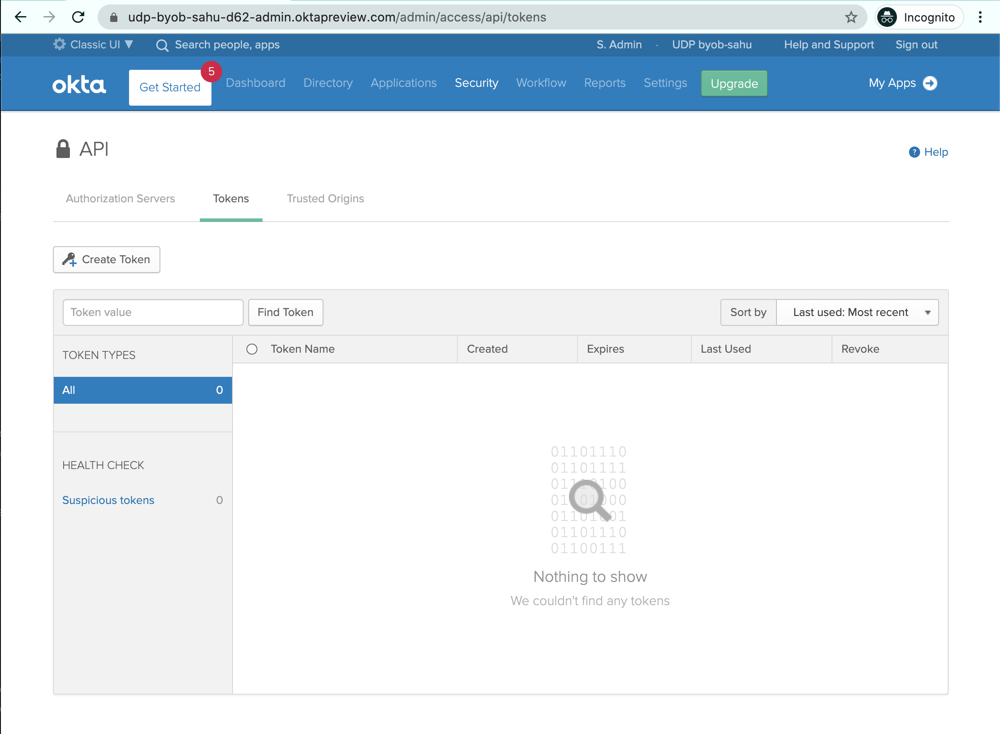
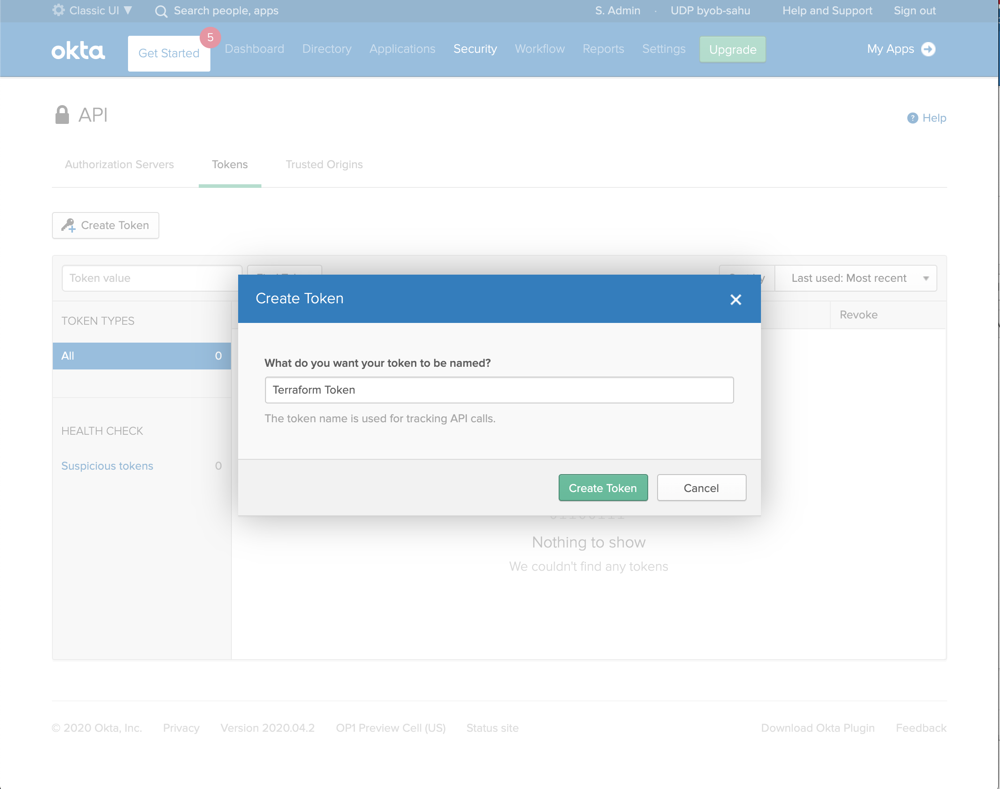
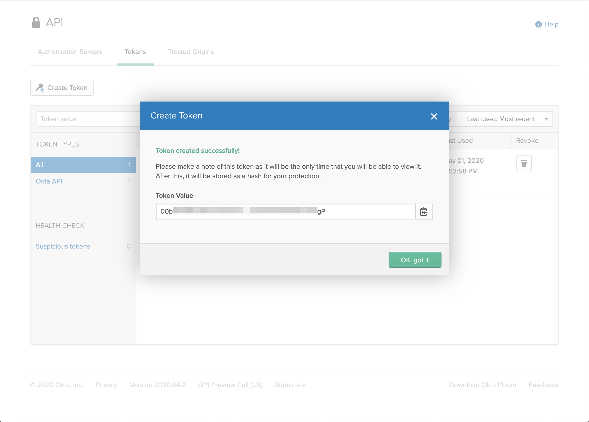

# Setup and Installation

The BYOB project will need to install custom serverless components within AWS and also refer to entities defined within the Okta tenant. BYOB leverages `terraform` and `serverless` to setup all the infrastructure as code.

## Install Terraform

Terraform is used to setup Okta.

See installation instructions here for your operating system: <https://learn.hashicorp.com/terraform/getting-started/install.html>

## Install Serverless

Serverless is used to setup AWS.

See installation instructions here for your operating system: <https://www.serverless.com/framework/docs/getting-started/>

## Programmatic Access to AWS

To enable programmatic access to AWS within terraform and serverless, you will need to create an IAM user with sufficient admin privileges.

Log in to the AWS account where you plan to host the BYOB artifacts and navigate to the `IAM` Service.

Click on `Users`

Click on `Add User`. Make sure to check `Programmatic access` as the access type.

Click `Next: Permissions`

In `Set Permissions`, select `Attach existing policies directly`.

Select the `Administrator Access` policy as below:

Click `Next: Tags`

Optional: Create a tag with key `okta` with value `byob`

Click `Next: Review` to review the user configuration.

Click `Create user`.

Once the user is created, you can download the csv with the `Access Key ID` and `Secret access key`.

## Programmatic Access to Okta

To enable programmatic access to Okta within Terraform, you need to do the following:

Log in to Admin dashboard of the Okta tenant. Make sure to login as a user with sufficient privileges to create entities like Applications and Authorization Servers

Navigate to `Security -> API -> Tokens`

Create a Token. You can name the token `Terraform Token`.

Make sure to copy the created token. This will be used in terraform.

### Superuser

About the Superuser role

<!--  -->

### Tenant Admin

About the Tenant Admin role

<!--  -->

## End-user Dashboard

This section discusses the End-User Dashboard

<!--  -->
