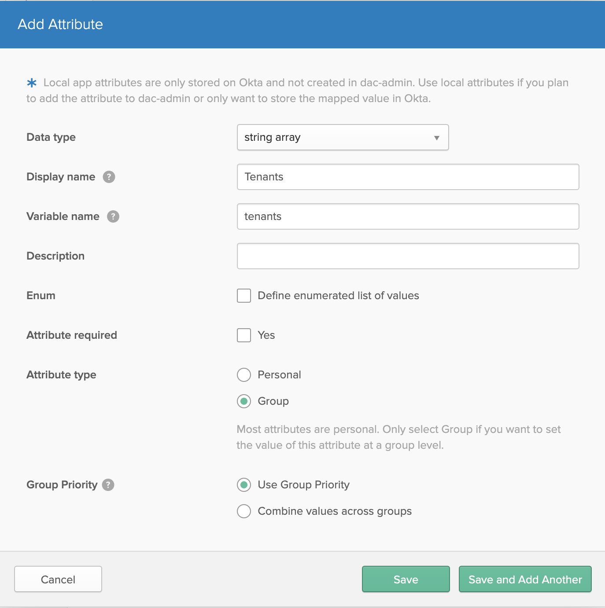
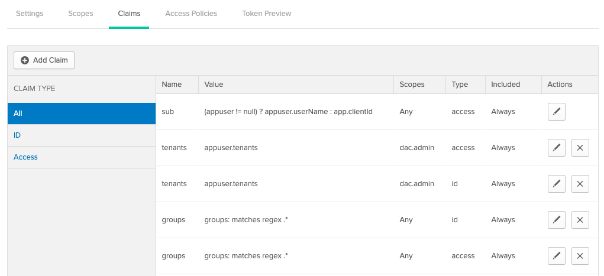
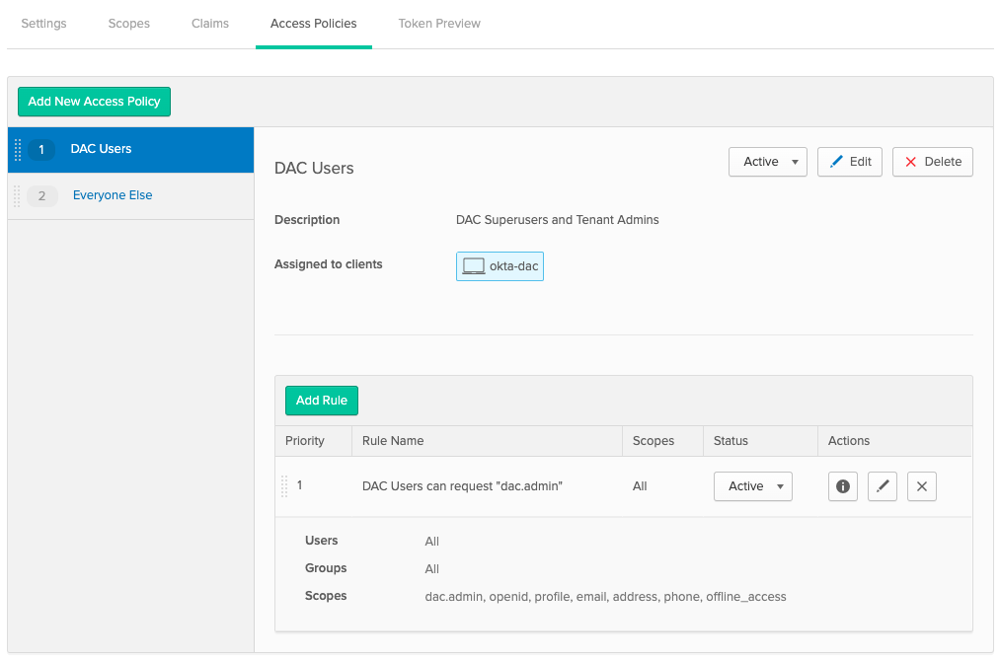
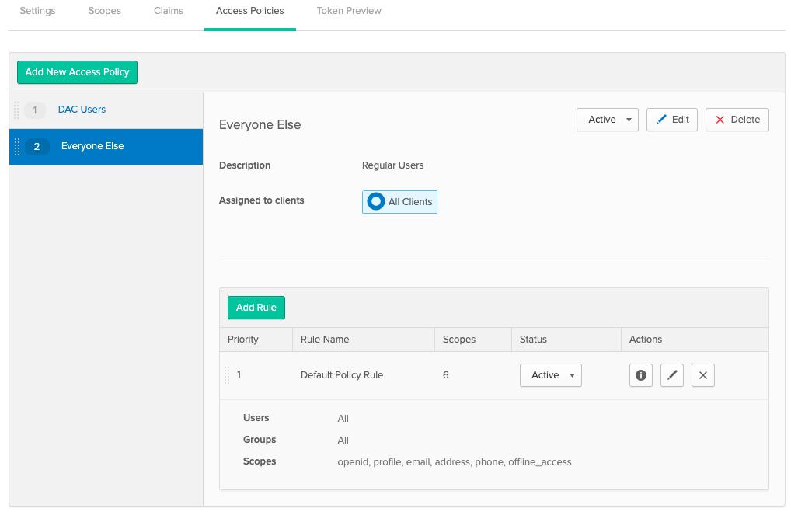
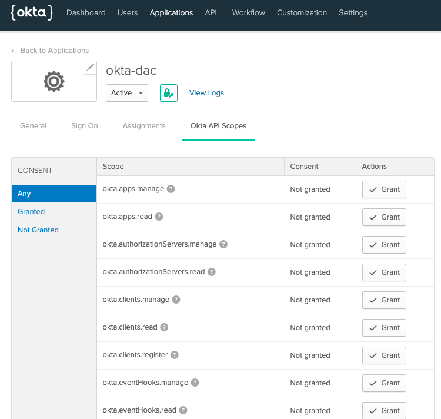

# Configure Okta

## Terraform
We use the [Okta Terraform Provider](https://www.terraform.io/docs/providers/okta/index.html) to automatically configure the Okta Org. Refer to the [terraform](terraform) section for more information. 

If you're more comfortable configuring the org manually, Follow the steps below: 

## Manual Config
#### 1. Add SUPERUSERS Group and Role
##### Add A Group:
* Name: __SUPERUSERS__
* Description: (optional)
##### Add An Administrator Role:
* From Security > Administrators, Click [Add Administrator Group]
    * Grant administrator role to `SUPERUSERS`
    * Administrator roles: **Super Administrator**

#### 2. Add byob-dashboard app
* Application type: __Single Page App (SPA)__
* Allowed grand types: __Authorization Code__
* Login redirect URIs: __http://localhost:8081/oauth/callback__
* Client authentication: __Use PKCE (for public clients)__

#### 3. Add okta-dac app
* Application type: __Single Page App (SPA)__
* Allowed grand types: __Authorization Code__
* Login redirect URIs: __http://localhost:8080/oauth/callback__
* Client authentication: __Use PKCE (for public clients)__

#### 4. Add custom app profile attribute
Add custom profile attribute to the __okta-dac__ application *App Profile*
::: warning NOTE
The `APPLICATION_ENTITLEMENT_POLICY` feature flag must be enabled for the Okta Org

This feature flag, when enabled allows configuration of app profile attributes that are tied to a Group. Meaning, when you set the value of the attribute, you set it to the Group assigned to the app, as opposed to directly setting it against a user. All users whom are members of the group will have the same value for said attribute.
:::
* Data type: __string array__
* Display name: __Tenants__
* Attribute type: __Group__
* Group Priority: __Combine values across groups__

#### 5. Add custom `dac.admins` scope to the `default` AuthorizationServer

#### 6. Add custom claims
Setup default `groups` claim:

| claim | expression | scope | token |
| ----- | ---------- | ----- | ----- |
| `groups` | `groups matches .*` | `Any` | id_token & access_token |

Setup claims bound to the custom scope `dac.admin` with the following values:

| claim | expression | scope | token |
| ----- | ---------- | ----- | ----- |
| `tenants` | `appuser.tenants` | `dac.admin` | id_token & access_token |

#### 7. Configure Access Policies
1. Add a policy: 
    * Name: (e.g.) __DAC Users__ (You can choose your own name)
    * Assigned to clients: __okta-dac__
    * Add a rule:
    IF `Grant type is Authorization Code` AND `User is Any user assigned the app` AND `Scopes requested = Any Scopes` THEN `No inline hook` AND `Access token lifetime is 1 Hours` AND `Refresh token lifetime is unlimited`

2. Update the default policy:
    * Name: Can leave as is. We decided to name it __Everyone Else__
    * Assigned to clients: __All Clients__
    * Configure the default policy rule:
    IF `Grant type is Authorization Code` AND `User is Any user assigned the app` AND `Scopes requested = [openid, profile, email, address, phone, offline_access]` THEN `No inline hook` AND `Access token lifetime is 1 Hours` AND `Refresh token lifetime is unlimited`        

#### 8. Add CORS
* Add a Trusted Origin: __http://localhost:8081__, Type=__CORS__
* Add a Trusted Origin: __http://localhost:8080__, Type=__CORS__

#### 9. Enable OAuth grants

1. Navigate to the __okta-dac__ application
2. In the **Okta API Scopes** tab, and Grant the following scopes:
    * `okta.groups.manage`
    * `okta.users.manage`

#### 10. Update User Activation Email Template

Both __okta-dac__ and __byob-dashboard__ implement a custom user welcome page. Update the __User Activation__ email template:
* Replace `${activationLink}` (shown above) with `http://localhost:8081/activate/${activationToken}` 
    * This will send users to __byob-dashboard__ (i.e. port 8081) on a custom "welcome page" (i.e. on the path `/activate`)
* If you're only running __okta-dac__ then replace it with `http://localhost:8080/activate/${activationToken}` (or appropriate port or `base_url` of the deployed application).